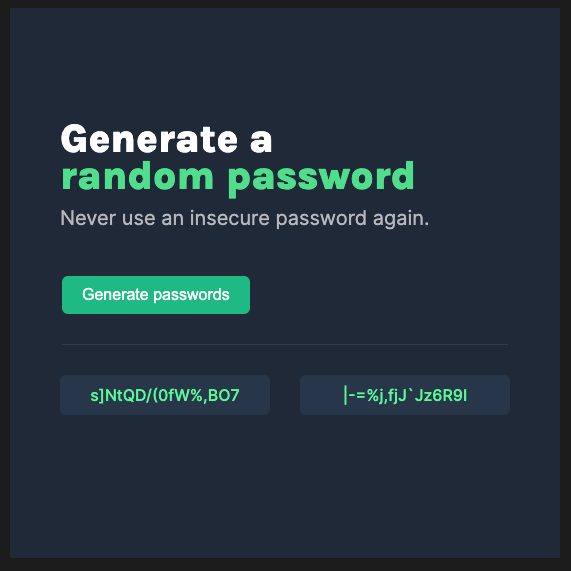

# Password Generator

A password generator app created with vanilla HTML, CSS, and JavaScript.

**Link to demo:** https://levipowis.github.io/js-password-generator/

## How It's Made:

**Tech used:** HTML, CSS, JavaScript

This was a solo project within the Scrimba Frontend Developer Career Path. I built this from a provided Figma design. I started with the HTML structure. After the structure was in place I worked on styling the app to match the design file. Once I had the app looking as close to the design as I could get it, I wrote the JavaScript to add the functionality to the app.

## Optimizations

Future planned improvements:

- Add a way to copy the passwords
- Add a dropdown to allow the user to select the password length
- Add toggle buttons for numbers and symbols

## Lessons Learned:

The styling was the hardest part for me in this project. I learned quite a bit through trial and error just trying to get the app to match the design. The main issue I ran into was that I forgot to add the .wrapper class and was trying to layout the app using the .container class which did not work. The padding was making the app grow in size which I finally figured out was because I missed the step of adding the wrapper.

Another little styling issue I ran into was how to manipulate the div inside the h1 to move the two lines closer together. I figured out a solution using negative margin.

The JavaScript was pretty straightforward. I didn't struggle at all on this project, it was a good confidence builder! I remembered to test with console.log about every five lines or so, it helped immensely.
